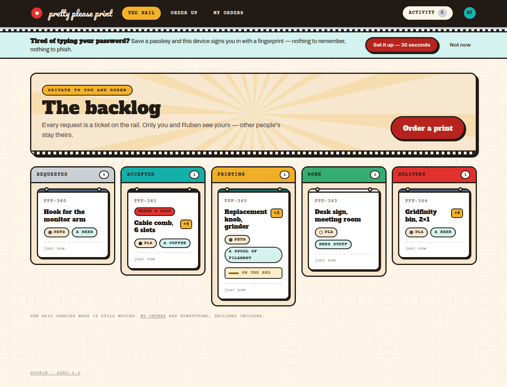
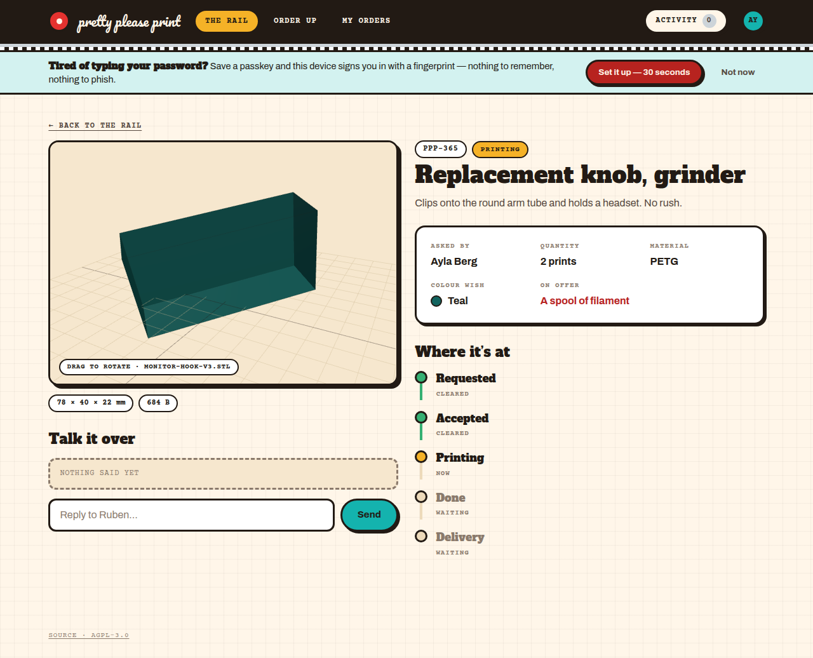
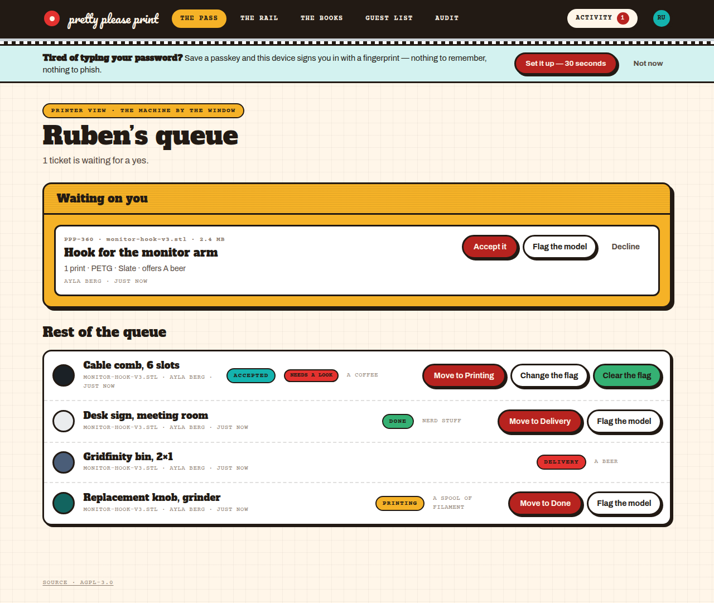

# Pretty Please Print

[](https://github.com/danileau/ppp/actions/workflows/ci.yml)
[](LICENSE)
[](docs/deployment.md)
[](https://github.com/danileau/ppp/stargazers)
[](https://github.com/danileau/ppp/network/members)

**Invite-only 3D print requests for a small office.** One person owns the
printer. Everyone else uploads a model, says what they are hoping for, and
follows it through the print stages on a board — instead of asking in a
corridor and then wondering.

Self-hosted, Docker Compose, no accounts anywhere but your own machine. Five
people and one printer is the size it is built for, and it is honest about
that: there is no multi-tenancy, no billing, and no queue theory.

## What it looks like

| The rail — every request as a ticket, scoped to who may see it |
| :-- |
|  |

| A ticket, with the actual uploaded geometry | The printer owner's queue |
| :-- | :-- |
|  |  |

## What it does

- **Invite-only.** There is no public sign-up. A `User` row cannot come into
  existence without a pending invitation, enforced in a single hook that every
  authentication method goes through.
- **Upload a model** — `.stl` or `.3mf`, validated against its actual bytes
  rather than its filename, measured for its bounding box, stored in object
  storage and never in the web root.
- **Follow it on a board** — Requested → Accepted → Printing → Done →
  Delivery, one step at a time, forwards only. Or Declined, with a reason.
- **Talk on the ticket** — a conversation thread per request, so "can you do it
  in teal" lives with the model rather than in a chat app.
- **Revoke access when someone leaves** — suspends the account, signs them out
  everywhere and refuses new sign-ins, while keeping their tickets, comments
  and history. Reversible, and audited.
- **See the actual geometry** — the uploaded mesh rendered in the browser,
  auto-framed, drag to rotate.
- **An audit trail** of everything that changes who can get in or what happens
  to someone's model, readable at `/admin/audit`, never edited or deleted.

## Requirements

| | |
| --- | --- |
| Host | anything that runs Docker Compose — a NAS, a Pi 5, a VPS, a spare laptop |
| Memory | ~1 GB for the whole stack (app, Postgres, MinIO) |
| Disk | small — the database is megabytes; uploads are capped at 50 MB each |
| TLS | **required.** The app refuses to start on plain `http://` in production, and passkeys need a secure context |
| Mail | **optional.** Nothing needs it — see [Mail is optional](docs/authentication.md#mail-is-optional--genuinely) |

## Quick start

```bash
git clone https://github.com/danileau/ppp.git && cd ppp
cp .env.docker.example .env.docker
```

Edit `.env.docker` — at minimum generate the three secrets and set your
hostname and admin:

```bash
BETTER_AUTH_SECRET="$(openssl rand -base64 32)"
DB_PASSWORD="$(openssl rand -hex 24)"
S3_SECRET_KEY="$(openssl rand -hex 24)"
APP_URL="https://print.example.org"
PASSKEY_RP_ID="print.example.org"
ADMIN_EMAIL="you@example.org"
ADMIN_NAME="Your Name"
```

Then bring it up. This build-from-source variant publishes ports and catches
mail locally, which is what you want for a first look:

```bash
docker compose --env-file .env.docker \
  -f docker-compose.prod.yml -f docker-compose.build.yml \
  -f docker-compose.test.yml --profile mailcatcher up -d --build
```

The migrator prints a **one-use link** for the admin to choose a username and
a password. Read it, and open it within thirty minutes:

```bash
docker compose --env-file .env.docker -f docker-compose.prod.yml logs migrate
```

Then invite the office from `/admin/invites`. For a real deployment behind a
reverse proxy, see **[docs/deployment.md](docs/deployment.md)**.

> There is deliberately no `ADMIN_PASSWORD`. A password in an env file is also
> in `docker inspect`, in the shell history that wrote it, and in every backup
> of the host — still valid months later. A link that expires in half an hour
> is a smaller thing to leak.

## Configuration

Everything is environment variables, read from `.env.docker`. The full file
with commentary is [`.env.docker.example`](.env.docker.example).

| Variable | Required | What it does |
| --- | --- | --- |
| `BETTER_AUTH_SECRET` | **yes** | Signs session cookies. `openssl rand -base64 32`. Losing it invalidates every session. |
| `DB_PASSWORD` | **yes** | Postgres password. Baked into the data directory on first start — see [Restore](#restore). |
| `S3_SECRET_KEY` | **yes** | MinIO root password. |
| `S3_ACCESS_KEY` | | MinIO root user. Default `ppp`. |
| `S3_BUCKET` | | Default `ppp-models`. |
| `APP_URL` | **yes** | The origin the browser sees, including scheme. Cookies, invitation links and the WebAuthn relying party derive from it. Must be `https://` in production. |
| `PASSKEY_RP_ID` | **yes** | Registrable domain, no scheme or port. **Permanent** — changing it kills every enrolled passkey. |
| `PASSKEY_RP_NAME` | | Shown in the browser's passkey prompt. |
| `ADMIN_EMAIL` / `ADMIN_NAME` | **yes** | The single admin, created on first start. |
| `DATA_ROOT` | | Where the database and uploads live on disk. Default `./data`. |
| `SMTP_URL` | | SMTP transport. **Leave unset and the app still works** — links are shown to the admin to hand over. |
| `RESEND_API_KEY` | | Alternative to `SMTP_URL`; takes precedence. |
| `MAIL_FROM` | | Envelope sender. |
| `TRUST_PROXY_HEADERS` | | Which header carries the client address: `false` (trust nothing, the default), `true` (left-most `X-Forwarded-For`), or `cloudflare` (`CF-Connecting-IP`). See [the reasoning](docs/deployment.md#why-trust_proxy_headers-is-a-separate-switch). |
| `HIBP_DISABLED` | | `true` disables the breach check. Only for a host with no outbound internet — it fails closed, so without it nobody could register. |
| `SOURCE_URL` | | Where this instance's source lives, shown in the footer. **Change it if you modify the code** — see [Licence](#licence). Defaults to the upstream repository. |
| `PPP_REGISTRY` / `PPP_TAG` | | Which published image to run. Pin `PPP_TAG` to a release (`v0.1.0`) or a commit SHA; either is also how you roll back. |

## Deploying

The short version: pull a published image, put a reverse proxy in front, point
`DATA_ROOT` at real storage.

```bash
docker compose --env-file .env.docker \
  -f docker-compose.prod.yml -f docker-compose.proxy.yml up -d
```

`docker-compose.prod.yml` **consumes** images rather than building them, so a
deployment needs no source tree and no toolchain, and what runs there is
byte-for-byte what CI tested and signed. It publishes **no host ports at all** —
each overlay adds only what its context needs.

Every merge to `main` publishes images tagged with the commit SHA and `latest`;
every `v*` tag publishes that same commit under its version. Pin `PPP_TAG` to a
release if you want to move deliberately, or to a SHA if you want to follow
`main` closely — the wizard lists both.

`scripts/deploy-wizard.sh` is the way to move between versions: it lists what is
published, cosign-verifies before swapping, health-checks after, and rolls back
on its own if the new image does not come good. See
**[docs/deployment.md](docs/deployment.md)**.

## Backup and restore

### Back up

Everything that matters is under `DATA_ROOT` plus one file:

| | |
| --- | --- |
| `$DATA_ROOT/db/` | Postgres — accounts, tickets, comments, the audit trail |
| `$DATA_ROOT/models/` | the uploaded `.stl` / `.3mf` files |
| `.env.docker` | the secrets. **Not** under `DATA_ROOT`, and not in the repo. |

On ZFS, one recursive snapshot of the parent dataset captures all three:

```bash
zfs snapshot -r storage/applications/ppp@$(date +%F)
```

That snapshot is *crash-consistent*, not clean — Postgres replays its WAL on
start and recovers, which is fine and is what it is designed for. If you want a
backup that can be restored into any Postgres rather than only onto this data
directory, take a logical dump alongside it:

```bash
docker exec ppp-db pg_dump -U ppp -Fc ppp > ppp-$(date +%F).dump
```

### Restore

```bash
# 1. stop the stack — never restore under a running Postgres
docker compose --env-file .env.docker -f docker-compose.prod.yml down

# 2. put the data back (ZFS rollback, or copy the files)
zfs rollback storage/applications/ppp/data/db@2026-08-23
zfs rollback storage/applications/ppp/data/models@2026-08-23

# 3. bring it up; the migrator applies any pending migrations
docker compose --env-file .env.docker -f docker-compose.prod.yml up -d
docker compose --env-file .env.docker -f docker-compose.prod.yml ps
```

Two things that will bite if you do not know them:

- **`DB_PASSWORD` must be the one the restored data was created with.** Postgres
  stores the password inside the data directory. Restore `db/` from an old
  backup while `.env.docker` holds a newly generated password and the app
  cannot connect, with an authentication error that looks like a config typo.
  This is the main reason `.env.docker` belongs in the backup.
- **`BETTER_AUTH_SECRET` is not recoverable.** Lose it and every session is
  invalidated — nobody is locked out permanently, everyone simply signs in
  again. Passwords and passkeys are unaffected.

Restore into a *different* host, or from a `pg_dump`, needs the database
recreated first:

```bash
docker exec -i ppp-db pg_restore -U ppp -d ppp --clean --if-exists < ppp-2026-08-23.dump
```

## Troubleshooting

**502 from the reverse proxy, nothing in the app's logs.**
The proxy cannot reach the container. If you route by container name over a
shared Docker network, check both are still on it — updating a proxy that is
itself a managed app recreates its container and silently drops the
attachment:

```bash
docker network inspect npm-proxy --format '{{range .Containers}}{{.Name}} {{end}}'
docker run --rm --network npm-proxy curlimages/curl -sS -m 5 http://ppp-app:3000/api/health
```

**`unauthorized` when pulling the images.**
The registry token needs **`read:packages`** and nothing else — it is a
*classic* token scope, nested under `write:packages` in the checkbox list.
Fine-grained tokens do not work with ghcr.io at all. Check what yours carries:

```bash
curl -sSI -H "Authorization: Bearer $TOKEN" https://api.github.com/user | grep -i x-oauth-scopes
```

**The certificate will not issue.**
ACME HTTP-01 validation goes to whatever the public DNS record points at. If
that is still your web host rather than your proxy, the challenge is answered
by the wrong machine and nothing you change locally will help. Check where the
name actually resolves, and what answers there:

```bash
dig +short your.host.example
curl -sS -D - "http://your.host.example/.well-known/acme-challenge/probe" | head -5
```

Behind Cloudflare's proxy, visitors see Cloudflare's certificate regardless, so
an **Origin Certificate** plus SSL mode *Full (strict)* removes ACME from the
picture entirely.

**Audit rows have no IP address.**
`TRUST_PROXY_HEADERS` is unset or `false`, so nothing is trusted. Behind
Cloudflare set it to `cloudflare` — not `true`, because Cloudflare *appends* to
`X-Forwarded-For` and the left-most entry there is whatever the client sent.
Behind a proxy that replaces the header, `true`. Set either only if the app
cannot be reached without going through that proxy.

**The bootstrap link expired.**
Re-run the migrator; it prints a fresh one, and keeps doing so until a password
is actually set. It never resets an existing password.

```bash
docker compose --env-file .env.docker -f docker-compose.prod.yml up -d migrate
docker compose --env-file .env.docker -f docker-compose.prod.yml logs migrate
```

**Nobody can register, and the error mentions a breach check.**
The password check calls `api.pwnedpasswords.com` and fails closed. If the host
has no outbound internet, set `HIBP_DISABLED=true` — and only then.

## Documentation

| | |
| --- | --- |
| **[Authentication](docs/authentication.md)** | invite-only registration, passwords, passkeys, resets, and why each decision went the way it did |
| **[Architecture](docs/architecture.md)** | the viewer, upload validation, decisions taken against the design handoff, and the file layout |
| **[Deployment](docs/deployment.md)** | containers, reverse proxies, the deploy wizard, TLS, first run |
| **[Development](docs/development.md)** | stack, local setup, the six verification suites, CI |
| **[Security audit](docs/security-audit.md)** | the OWASP Top 10 assessment, findings, and residual risk accepted |
| **[Security policy](SECURITY.md)** | how to report a vulnerability |
| **[Contributing](CONTRIBUTING.md)** | the six suites are the contract; what a good change looks like |
| **[Changelog](CHANGELOG.md)** | what changed in each release |

## Security

Invite-only enforced in one hook across every authentication method. Passwords
are ≥10 characters and refused if they appear in a known breach corpus.
Authorisation answers **404, not 403**, for a resource you may not see — a 403
confirms it exists. Session cookies are `HttpOnly`, `SameSite=Lax` and
`__Secure-` prefixed, with cookie caching deliberately off so sign-out is
immediate. CSP carries a per-request nonce. Every access and content change is
audited.

The full assessment, including what was found and fixed and what is knowingly
accepted, is in [docs/security-audit.md](docs/security-audit.md). To report
something, see [SECURITY.md](SECURITY.md).

## Contributing

Issues and pull requests are welcome. The six verification suites in
`scripts/` are the contract — `npm run verify:auth`, `verify:upload`,
`verify:queue`, `verify:models`, `verify:passkey` and `probe:security` all run
in CI against the built container image, not a dev server. If a change makes
one fail, that is the change talking.

See [docs/development.md](docs/development.md) to get set up.

## Licence

[AGPL-3.0-or-later](LICENSE). Self-host it, fork it, change it, run it for your
office — all of that is yes, and free.

The app carries a **Source · AGPL-3.0** link in its footer. That is section 13
made real: if you modify the code, point `SOURCE_URL` at your own repository.
Leaving it aimed at upstream is worse than removing it, because it looks like
compliance while offering source that is not what is running.

The one condition is the point of the licence: **if you modify it and let people
use your version over a network, you have to offer them your source.** Not a
courtesy, a term. It covers the case a plain GPL misses — running a modified
version as a service without ever distributing a copy — which is exactly how
web software gets taken private.

What that does and does not mean:

- **Running it unmodified obliges you to nothing.** Deploy it for your office,
  never touch the code, and there is nothing to publish and nobody to tell.
- **Modify it and let others use it, and those users can ask for your source.**
  Note *others* includes your own colleagues — §13 counts anyone interacting
  over a network, not just paying customers. In practice that is easy: point
  them at your fork.
- **Selling it is allowed.** No open source licence forbids commercial use, and
  this one does not either. Sell support, sell hosting, sell it outright — your
  users just get the source too.
- **Modification nobody else touches is unconstrained.** Hack on it locally, on
  your own, forever, and the clause never bites.

The asymmetry is deliberate: the licence asks for reciprocity from those who
benefit publicly, and nothing from those who merely use it.

If your organisation's policy forbids AGPL software — some do, blanket-style —
you are welcome to ask about other terms.

Built from the design handoff in `Pretty Please Print/`, which is why story refs
read `PPP-104` and the copy sounds like a diner.
